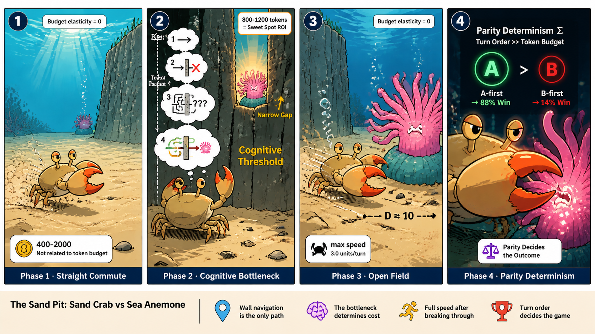
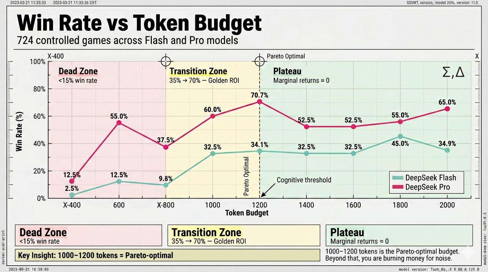
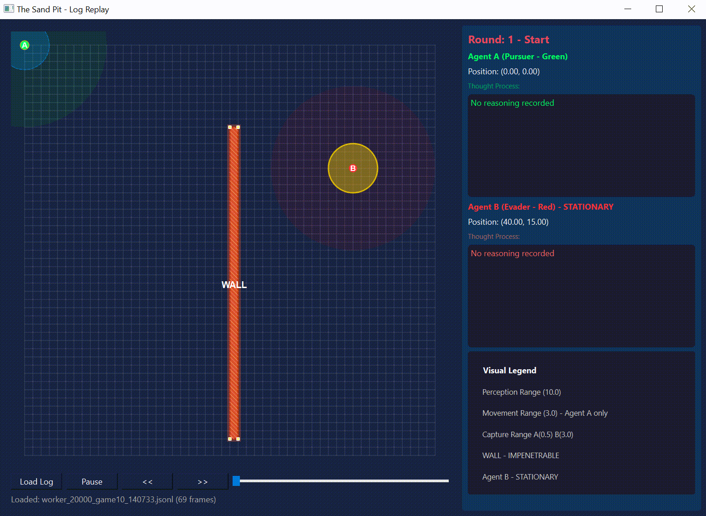
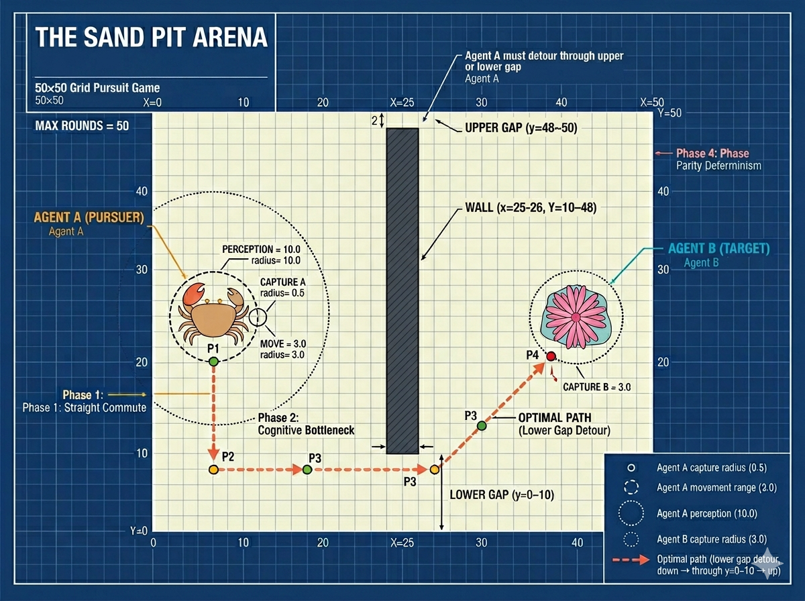

# The Sand Pit

> **Can we quantify the "cognitive threshold" of an LLM by manipulating its token budget?**


*Figure 1: A four-panel comic visualizing the four game phases through Sand Crab (Agent A) and Sea Anemone (Agent B). **Schematic illustration — exact game parameters (coordinates, radii, move step, etc.) are defined in the Game Rules table and `config.py`.***

---

## The Sand Pit

**A Parameterized LLM Multi-Agent Adversarial Simulation System for Token Economics Research**

When LLM Agents move from "chatbots" to "autonomous actors," every thought has a price. The Sand Pit is a 50x50 grid pursuit game designed to answer one question: **How much token budget does an LLM actually need to solve a spatial reasoning task — and where does the utility inflection point lie?**

Through **724 controlled games** across two DeepSeek models (Flash & Pro) and ten token budgets (400–2000 tokens, plus 20K thinking mode), we discovered a **non-linear, three-stage threshold effect** that challenges the common assumption that "more tokens = more intelligence."


*Figure 2: The non-linear three-stage threshold effect observed across DeepSeek Flash and Pro models. The steepest improvement occurs between 800–1200 tokens. **Schematic illustration — refer to `results/win_rate_data.json` for exact figures.***

### The Three-Stage Threshold

| Stage | Token Budget | Win Rate | What Happens |
|-------|-------------|----------|--------------|
| **Dead Zone** | 400–800 | <15% | Agent lacks cognitive bandwidth; wanders randomly near the wall |
| **Transition Zone** | 800–1200 | 35% → 70% | The "golden ROI period" — budget buys the ability to plan around obstacles |
| **Plateau** | 1200+ | Flat | Marginal returns drop to near zero; extra tokens do not buy better strategy |

**Key insight**: 1000–1200 tokens is the Pareto-optimal budget for this task. Beyond that, you are burning money for noise.


*Figure 3: A representative game session showing Agent A navigating around the wall to capture Agent B. Use `python replay_log.py <log_file>` to replay any logged game in full detail. **Schematic illustration — exact parameters are defined in `config.py` and the Game Rules table.***

### Five Core Thoughts

1. **Budget Effects Are Phase-Locked**: Token budget only matters in Phase 2 (wall navigation). Phase 1/3 are physical commutes (budget elasticity = 0). Phase 4 is dominated by turn-order parity, not budget.

2. **The Overthinking Paradox**: High-token rounds produce *less* spatial progress and *larger* logic-action deltas (56.8° vs 35.1°). More "thinking" does not equal better "acting" — it signals the agent is stuck.

3. **The Draw Disaster**: Drawn games consume ~2x more tokens than decisive games (median 65,958 vs 36,808 tokens) but produce zero value. Reducing draw rate is the highest-leverage cost optimization.

4. **Parity Determinism**: In Phase 4 (hunt), win rate is determined by whether the round starts on an A-first or B-first turn (88% vs 14% at the same distance). The LLM does **not** spontaneously develop turn-order strategy, even at 20K tokens.

5. **Cognitive Saturation**: Stronger models (Pro) reach an internal "cognitive ceiling" — their token consumption does not scale with budget (r=0.015, ns). Weaker models (Flash) are budget-driven (r=0.174, p<.001).

---

## Data & Reproducibility

### Raw Experiment Logs (`log_final/`)

All **724 game logs** are included in this repository under `log_final/`. Each subdirectory contains per-game JSONL files and summary JSONs for a specific model and token budget:

- `deepseek_v4_flash_thinking_disabled/` — 40 games each at 400–2000 tokens
- `deepseek_v4_flash_thinking_enabled/` — 20 games at 20K tokens (reasoning mode)
- `deepseek_v4_pro_thinking_disabled/` — 40 games each at 400–2000 tokens
- `deepseek_v4_pro_thinking_enabled/` — 20 games at 20K tokens (reasoning mode)

> **Security note**: All logs have been reviewed for API keys and secrets. The JSONL format only records `base_url`, `model_name`, `temperature`, and `timeout` — no `api_key` field is present.

### Detailed Win / Loss / Draw Breakdown

The tables below show the raw outcome counts for every model and token budget tested. All standard-mode experiments ran **40 games per budget** (except where noted); reasoning-mode experiments ran **20 games**.

#### DeepSeek Flash (standard mode)

| Budget | Wins | Draws | Losses | N | Win Rate | Draw Rate |
|--------|------|-------|--------|---|----------|-----------|
| 400 | 1 | 36 | 3 | 40 | 2.5% | 90.0% |
| 600 | 5 | 32 | 3 | 40 | 12.5% | 80.0% |
| 800 | 4 | 30 | 6 | 41 | 9.8% | 73.2% |
| 1000 | 13 | 18 | 9 | 40 | 32.5% | 45.0% |
| 1200 | 14 | 18 | 7 | 41 | 34.1% | 43.9% |
| 1400 | 13 | 20 | 7 | 40 | 32.5% | 50.0% |
| 1600 | 13 | 18 | 9 | 40 | 32.5% | 45.0% |
| 1800 | 18 | 13 | 9 | 40 | 45.0% | 32.5% |
| 2000 | 15 | 13 | 12 | 40 | 34.9% | 30.2% |

#### DeepSeek Flash (reasoning mode, 20K tokens)

| Budget | Wins | Draws | Losses | N | Win Rate | Draw Rate |
|--------|------|-------|--------|---|----------|-----------|
| 20000 | 13 | 2 | 5 | 20 | 65.0% | 10.0% |

#### DeepSeek Pro (standard mode)

| Budget | Wins | Draws | Losses | N | Win Rate | Draw Rate |
|--------|------|-------|--------|---|----------|-----------|
| 400 | 5 | 26 | 9 | 40 | 12.5% | 65.0% |
| 600 | 22 | 5 | 13 | 40 | 55.0% | 12.5% |
| 800 | 15 | 5 | 20 | 40 | 37.5% | 12.5% |
| 1000 | 24 | 0 | 16 | 40 | 60.0% | 0.0% |
| 1200 | 29 | 2 | 10 | 41 | 70.7% | 4.9% |
| 1400 | 21 | 3 | 16 | 40 | 52.5% | 7.5% |
| 1600 | 21 | 2 | 17 | 40 | 52.5% | 5.0% |
| 1800 | 22 | 2 | 16 | 40 | 55.0% | 5.0% |
| 2000 | 26 | 1 | 13 | 40 | 65.0% | 2.5% |

#### DeepSeek Pro (reasoning mode, 20K tokens)

| Budget | Wins | Draws | Losses | N | Win Rate | Draw Rate |
|--------|------|-------|--------|---|----------|-----------|
| 20000 | 16 | 0 | 4 | 20 | 80.0% | 0.0% |

### Aggregated Results (`results/`)

- `results/win_rate_data.json` — Machine-readable statistics for every model × budget combination.
- `results/README.md` — Human-readable win-rate tables.

### Research Article (`docs/`)

The full research write-up (in Chinese) is available as a PDF:

- [`docs/沙坑研究（the_sand_pit).pdf`](docs/沙坑研究（the_sand_pit).pdf) — 12 MB, comprehensive analysis of the three-stage threshold effect, statistical tests, and interpretation.

> Click the link above to view or download the PDF directly from the repository.

---

## Quick Start

### 1. Clone and Install

```bash
git clone <repo-url>
cd the_sand_pit
pip install -r requirements.txt
```

Requirements: Python 3.8+, `requests`, `anthropic`, `PyQt6` (for replay GUI).

### 2. Configure API Key

```bash
cp config.example.json config.json
# Edit config.json and add your API key
```

Or use environment variables (recommended for CI/CD):

```bash
export OPENAI_API_KEY="sk-..."
# or
export ANTHROPIC_API_KEY="sk-..."
```

### 3. Switch API Provider (Optional)

```bash
# Switch to DeepSeek
python switch_api.py --deepseek

# Switch to OpenAI
python switch_api.py --openai

# Test connectivity
python switch_api.py --test
```

### 4. Run a Single Game

```python
from physics import Position
from agent import Agent
from game_engine import GameEngine
from logger import GameLogger
from prompts import PromptManager
from config import get_config
from api_clients import create_api_client

config = get_config("config.json")
logger = GameLogger(log_dir="logs", experiment_id="demo_game", config=config.to_dict())
prompt_manager = PromptManager()

agent_a = Agent("Agent_A", Position(0, 0), config, logger, prompt_manager)
agent_b = Agent("Agent_B", Position(0, 0), config, logger, prompt_manager)

engine = GameEngine(config, agent_a, agent_b, logger)
result = engine.run_full_game()

print(f"Winner: {result['winner']}, Rounds: {result['total_rounds']}")
```

### 5. Run Gradient Experiment

```bash
# Run 40 games each at token budgets 600, 800, 1000
python test_scripts/parallel_gradient_test.py --tokens 600 800 1000 --games 40
```

### 6. Replay a Game

```bash
python replay_log.py logs/gradient_test/worker_600_game01_*.jsonl
```

---

## Project Structure

```
the_sand_pit/
├── README.md                    # This file
├── LICENSE                      # MIT License
├── requirements.txt             # Python dependencies
├── .gitignore                   # Git ignore rules
├── config.example.json          # Configuration template (no secrets)
│
├── __init__.py                  # Package init
├── config.py                    # Configuration dataclasses and loader
├── physics.py                   # Physics engine: movement, collision, capture
├── agent.py                     # LLM Agent: API interaction, decision logic
├── game_engine.py               # Game engine: turn protocol, state machine
├── prompts.py                   # Prompt engineering: minimal & reasoning strategies
├── logger.py                    # Granular JSONL logging system
├── replay_log.py                # PyQt6 log replay GUI
├── switch_api.py                # CLI tool to switch API providers
│
├── api_clients/                 # LLM API adapters
│   ├── __init__.py              # Base client and factory
│   ├── openai_client.py         # OpenAI-compatible client
│   └── anthropic_client.py      # Anthropic SDK client
│
├── test_scripts/                # Experiment runners
│   └── parallel_gradient_test.py  # Parallel gradient test with rate limiting
│
├── token_economy/               # Analysis pipeline
│   ├── extract_game_data.py     # Extract per-round data from logs
│   ├── token_economy_analysis.py # Comprehensive statistical analysis
│   ├── formal_assumption_checks.py # Statistical assumption validation
│   ├── corrected_nonparametric_tests.py # Non-parametric tests with effect sizes
│   └── visualize_per_round_tokens.py # Per-round token usage visualization
│
├── log_final/                   # Raw experiment logs (724 games, no secrets)
│   ├── deepseek_v4_flash_thinking_disabled/
│   ├── deepseek_v4_flash_thinking_enabled/
│   ├── deepseek_v4_pro_thinking_disabled/
│   └── deepseek_v4_pro_thinking_enabled/
│
├── results/                     # Aggregated win-rate statistics
│   ├── win_rate_data.json       # Machine-readable results
│   └── README.md                # Human-readable tables
│
├── docs/                        # Research documentation
│   ├── 沙坑研究（the_sand_pit).pdf  # Full research article (PDF)
│   ├── comic_prompt.md          # 4-panel comic generation prompt
│   └── images/                  # README assets (diagrams, comics, charts)
│       ├── win_rate_curve.png
│       ├── game_arena_diagram.png
│       └── comic_4panel_sand_crab_vs_anemone.png
```

---

## Game Rules


*Figure 4: The 50×50 grid arena. Agent A (pursuer) starts left of the wall; Agent B (target) starts right. **Schematic illustration — exact wall coordinates, spawn points, radii and movement parameters are defined in `config.py` and the Game Rules table below.***

| Parameter | Agent A (Pursuer) | Agent B (Target) |
|-----------|-------------------|------------------|
| Movement | Up to 3.0 units per turn | Stationary |
| Capture Radius | 0.5 | 3.0 (6x larger) |
| Turn Order | Alternates each round | — |
| Perception | 10.0 units | — |
| Max Rounds | 50 | — |

**Four Phases**:
- **Phase 1 (Pre-wall)**: Straight-line approach. Budget elasticity = 0.
- **Phase 2 (Wall-nav)**: The cognitive bottleneck. Budget effects concentrate here.
- **Phase 3 (Post-wall)**: Open-field commute. Budget elasticity = 0.
- **Phase 4 (Hunt)**: Precision capture. Dominated by turn-order parity, not budget.

---

## Architecture

```
┌─────────────────────────────────────────┐
│           GameEngine                     │
│  (turn protocol, win/loss detection)     │
└─────────────────────────────────────────┘
           │
    ┌──────┴──────┐
    ▼             ▼
┌────────┐   ┌────────┐
│ Agent  │   │ Agent  │
│   A    │   │   B    │
└────┬───┘   └────┬───┘
     │            │
     ▼            ▼
┌─────────────────────────────────────────┐
│  PhysicsEngine                           │
│  (movement clamp, boundary, wall,        │
│   capture detection)                     │
└─────────────────────────────────────────┘
     │
     ▼
┌─────────────────────────────────────────┐
│  PromptManager -> LLM API -> JSON parse │
└─────────────────────────────────────────┘
     │
     ▼
┌─────────────────────────────────────────┐
│  GameLogger (JSONL black box)            │
└─────────────────────────────────────────┘
```

---

## Configuration

The system uses a JSON configuration file. See `config.example.json` for all available options:

| Section | Key | Description |
|---------|-----|-------------|
| `api` | `api_key` | Your LLM API key |
| `api` | `base_url` | API base URL |
| `api` | `model_name` | Model identifier |
| `world` | `map_size` | Arena size (NxN) |
| `world` | `max_rounds` | Max rounds per game |
| `world` | `turn_order_mode` | `"random"` or `"alternating"` |
| `physics` | `perception_radius` | Visibility range |
| `physics` | `move_step` | Max movement per turn |
| `physics` | `capture_radius` | Agent A capture distance |
| `physics` | `agent_b_capture_radius` | Agent B capture distance |
| `experiment` | `token_budget` | Token budget (maps to max_tokens) |
| `logging` | `log_dir` | Log output directory |
| `walls` | — | List of impassable wall rectangles |
| `spawn_points` | — | Starting positions for agents |
| `prompt_templates` | — | Custom system/user prompt templates |

---

## Adding a GIF to This README

If you record a gameplay GIF and want to add it to this README:

1. **Place the GIF** in `docs/images/` (e.g., `docs/images/gameplay_demo.gif`)
2. **Add the reference** in this file:
   ```markdown
   
   *Figure X: A recorded gameplay session showing Agent A navigating around the wall to capture Agent B.*
   ```
3. **Commit and push**:
   ```bash
   git add docs/images/gameplay_demo.gif README.md
   git commit -m "Add gameplay demo GIF"
   git push origin main
   ```

> GitHub automatically renders GIFs in READMEs just like PNGs. Recommended: keep the file under 5 MB for fast loading.

---

## Citation

If you use The Sand Pit in your research, please cite:

```bibtex
@software{the_sand_pit,
  title = {The Sand Pit: A Parameterized LLM Multi-Agent Adversarial Simulation System},
  author = {Huawei REN},
  year = {2026},
  url = {<repo-url>}
}
```

---

## License

MIT License. See [LICENSE](LICENSE) for details.

---

## Acknowledgments

This project was built to systematically study the relationship between LLM token budgets and spatial reasoning performance. The "budget threshold" phenomenon — where performance sharply improves within a narrow token range (800-1200 tokens) and then plateaus — was discovered through experiments conducted with this framework.
